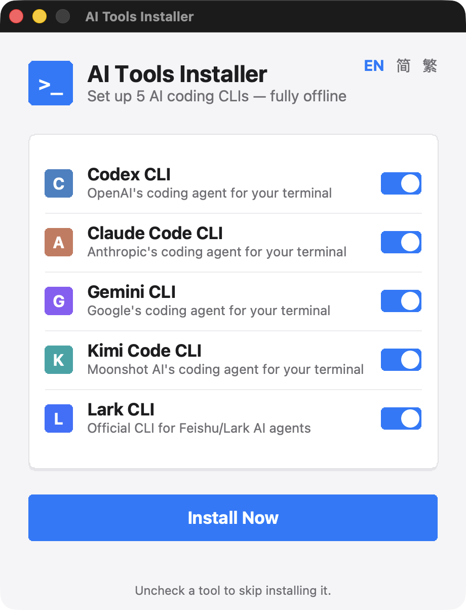

# Easy Codex and Claude CLI Setup
*Created by **[bandusix](https://github.com/bandusix)***

🌍 *[English](#english-version) | [中文](#中文版)*

---

## 中文版

一个傻瓜式、一键执行的 GUI 安装工具，专为在 macOS 和 Windows 上实现 **Codex CLI** 与 **Claude Code CLI** 的**完全离线、零配置**安装而设计。

  

### 🚀 核心特性
- **真正的跨平台**：原生支持 macOS (Apple Silicon M1/M2/M3 & Intel) 以及 Windows (x64)。
- **100% 纯离线安装包**：所有的 Node.js 运行时、Claude Code NPM 离线包、以及 Codex 官方预编译二进制文件，均已全数打包进单个可执行文件中。**安装全程无需任何网络连接，告别网络报错！**
- **现代化原生质感界面**：Windows 端采用 Fluent Design 视觉语言，macOS 端采用原生 macOS 设计规范，圆角卡片、开关组件均为精细手绘渲染，告别老旧的 Tkinter 默认外观。
- **三语言界面，自动适配**：内置英文 / 简体中文 / 繁體中文，安装器会根据系统语言自动切换（台湾、香港、澳门用户自动显示繁体），也可在右上角随时手动切换。
- **零配置体验**：自动管理系统环境变量（PATH），自动建立软链接和环境隔离目录，绝对不会污染你的系统全局包。

### 📥 下载与小白使用教程

无论你是技术小白还是老手，只需 1 分钟即可完成安装。请前往 [Releases](https://github.com/bandusix/easy-codex-and-claude-cli-setup/releases) 页面下载最新版本。

#### 🍏 macOS 用户
1. 下载 `AI_Tools_Installer_macOS.dmg` 文件。
2. 双击打开 `.dmg` 文件，你会看到一个名为 `AI Tools Installer.app` 的应用程序。
3. 双击运行 `AI Tools Installer.app`（如果系统提示"未知开发者"，请前往 `系统设置 -> 隐私与安全性` 中点击"仍要打开"）。
4. 在弹出的可视化界面中，右上角可切换界面语言，勾选你需要安装的工具，点击 **Install Now / 立即安装**。
5. **安装完成后，请彻底关闭并重新打开你的终端（Terminal 或 iTerm2）**。
6. 在终端输入 `codex` 或 `claude` 即可直接开始使用！

#### 🪟 Windows 用户
1. 下载 `AI_Tools_Installer_Windows.exe` 文件。
2. 双击运行该 `.exe` 文件（如果 Windows Defender 弹出拦截提示，请点击"更多信息" -> "仍要运行"）。
3. 在弹出的可视化界面中，右上角可切换界面语言，勾选你需要安装的工具，点击 **Install Now / 立即安装**。
4. **安装完成后，请彻底关闭并重新打开你的命令提示符（CMD）或 PowerShell**。
5. 在黑框框中输入 `codex` 或 `claude` 即可直接开始使用！

### 🛠️ 开发者说明 (原理)
本项目的核心是依托 **GitHub Actions** 自动化完成了繁重的跨平台封装：
1. 自动抓取各平台的 Node.js 运行时及 Claude Code tarballs。
2. 自动拉取 macOS 与 Windows 双平台的官方 Codex 预编译二进制（无需在 CI 中现场编译，构建更快、更稳定）。
3. 使用 PyInstaller 将所有资源打包为内嵌 Tkinter GUI 的独立 `.dmg` 与 `.exe` 安装包，GUI 本身通过 Canvas 手绘实现平台特定的现代化视觉风格与多语言文案。

---

## English Version

A foolproof, one-click GUI installer designed to set up the **Codex CLI** and **Claude Code CLI** across macOS and Windows with absolute zero configuration and **fully offline** capability.

  

### 🚀 Features
- **True Cross-Platform**: Natively supports macOS (Apple Silicon M1/M2/M3 & Intel) and Windows (x64).
- **100% Offline Payload**: Bundles Node.js runtime, Claude Code NPM packages, and official pre-compiled Codex binaries into a single executable. No network issues during installation!
- **Modern, Platform-Native UI**: Fluent Design styling on Windows, macOS-native styling on macOS — rounded cards and toggle switches hand-drawn on canvas, no more dated default Tkinter look.
- **Trilingual, Auto-Detected**: Ships with English / Simplified Chinese / Traditional Chinese. The installer auto-switches based on your system locale (Traditional Chinese for Taiwan/Hong Kong/Macau users), with a manual switcher in the top-right corner.
- **Zero Config**: Automatically manages PATH environments, symbolic links, and isolated directories without polluting your global system packages.

### 📥 Download & Beginner's Guide

Install everything in just 1 minute, no technical knowledge required. Head over to the [Releases](https://github.com/bandusix/easy-codex-and-claude-cli-setup/releases) page to download the latest version.

#### 🍏 macOS Users
1. Download the `AI_Tools_Installer_macOS.dmg` file.
2. Double-click the `.dmg` file to mount it, you will see an application named `AI Tools Installer.app`.
3. Double-click `AI Tools Installer.app` to run it (If macOS blocks it, go to `System Settings -> Privacy & Security` and click "Open Anyway").
4. In the pop-up GUI, switch the display language from the top-right corner if needed, select the tools you want, and click **Install Now**.
5. **Once finished, completely close and reopen your Terminal or iTerm2.**
6. Type `codex` or `claude` to start coding!

#### 🪟 Windows Users
1. Download the `AI_Tools_Installer_Windows.exe` file.
2. Double-click to run it (If Windows Defender pops up, click "More info" -> "Run anyway").
3. In the pop-up GUI, switch the display language from the top-right corner if needed, select the tools you want, and click **Install Now**.
4. **Once finished, completely close and reopen your Command Prompt (CMD) or PowerShell.**
5. Type `codex` or `claude` to start coding!

### 🛠️ How It Works (For Developers)
This project uses **GitHub Actions** to automate the heavy lifting:
1. It downloads Node.js runtimes and Claude Code tarballs for all platforms.
2. It fetches the official pre-compiled Codex binaries for both macOS and Windows (no in-CI compilation, keeping builds fast and reliable).
3. Finally, it uses PyInstaller to package everything into a `.dmg` and `.exe` with a Tkinter GUI, whose platform-aware modern styling and multilingual text are hand-drawn on a canvas.

## 🤝 Contributing
Feel free to open issues or submit pull requests!

---
*Built with ❤️ for the AI developer community by bandusix.*
